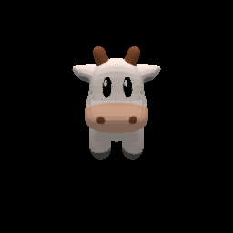
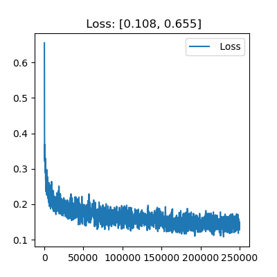
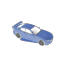
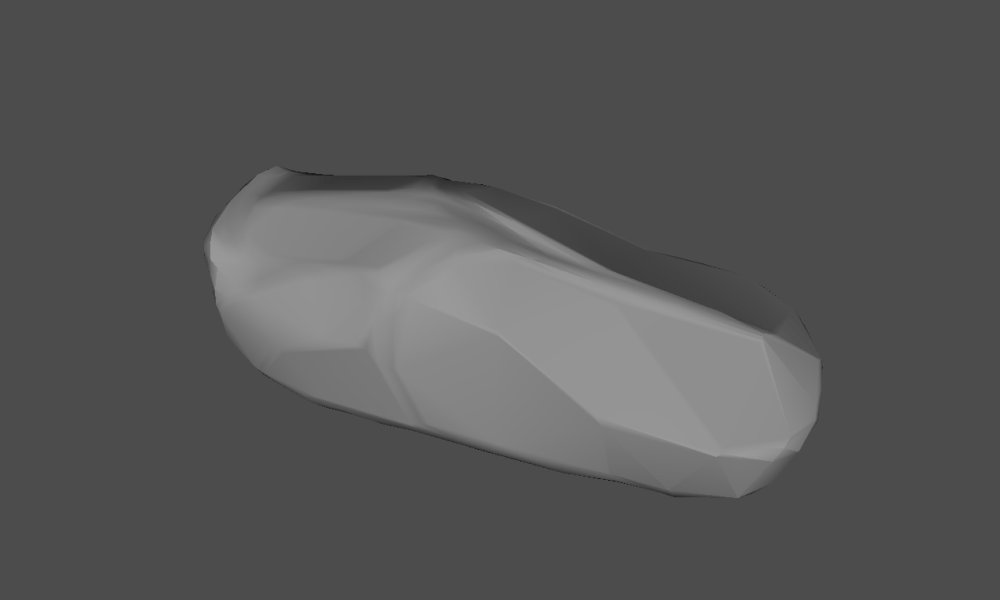

# [SoftRas](https://github.com/ShichenLiu/SoftRas)

## Install

```bash
conda activate torch
python - <<-EOF
import platform
import torch
print(f"Python : {platform.python_version()}")
print(f"PyTorch: {torch.__version__}")
print(f"  CUDA : {torch.version.cuda}")
EOF

Python : 3.8.10
PyTorch: 1.9.0
  CUDA : 11.1
```

```bash
git clone https://github.com/ShichenLiu/SoftRas.git
cd SoftRas
python setup.py install
```

<!--
cat <<-EOF > ~/.pydistutils.cfg
[easy_install]
index_url = http://mirrors.aliyun.com/pypi/simple
EOF

# ~/.config/pip/pip.conf
pip config set global.index-url http://mirrors.aliyun.com/pypi/simple
pip config set install.trusted-host mirrors.aliyun.com
-->

## Applications

```bash
snap install ogre-meshviewer
```

<!--
snap install blender

sudo apt install -y openctm-tools
ctmviewer data/obj/spot/spot_triangulated.obj
-->

### Rendering

Run:

```bash
CUDA_VISIBLE_DEVICES=0 python examples/demo_render.py
```

Result:



Compare obj:

```bash
ogre-meshviewer data/obj/spot/spot_triangulated.obj

ogre-meshviewer data/results/output_render/saved_spot.obj
```

### 3D Unsupervised Single-view Mesh Reconstruction

Download datasets:

```bash
bash examples/recon/download_dataset.sh
```

Train the model:

```bash
$ CUDA_VISIBLE_DEVICES=0 python examples/recon/train.py -eid recon
Loading dataset: 100%|██████████████████████████| 13/13 [00:35<00:00,  2.74s/it]
Iter: [0/250000]	Time 1.189	Loss 0.655	lr 0.000100	sv 0.000100
Iter: [100/250000]	Time 0.464	Loss 0.405	lr 0.000100	sv 0.000100
...
Iter: [250000/250000]	Time 0.450	Loss 0.128	lr 0.000030	sv 0.000030
```



Test the model:

```bash
$ CUDA_VISIBLE_DEVICES=0 python examples/recon/test.py -eid recon \
    -d 'data/results/models/recon/checkpoint_0250000.pth.tar'
Loading dataset: 100%|██████████████████████████| 13/13 [00:03<00:00,  3.25it/s]
Iter: [0/97]    Time 0.419      IoU 0.697
=================================
Mean IoU: 65.586 for class Airplane

Iter: [0/43]    Time 0.095      IoU 0.587
=================================
Mean IoU: 49.798 for class Bench

Iter: [0/37]    Time 0.089      IoU 0.621
=================================
Mean IoU: 68.975 for class Cabinet

Iter: [0/179]   Time 0.088      IoU 0.741
Iter: [100/179] Time 0.083      IoU 0.772
=================================
Mean IoU: 74.224 for class Car

Iter: [0/162]   Time 0.086      IoU 0.565
Iter: [100/162] Time 0.085      IoU 0.522
=================================
Mean IoU: 52.933 for class Chair

Iter: [0/26]    Time 0.094      IoU 0.681
=================================
Mean IoU: 60.553 for class Display

Iter: [0/55]    Time 0.087      IoU 0.526
=================================
Mean IoU: 45.751 for class Lamp

Iter: [0/38]    Time 0.086      IoU 0.580
=================================
Mean IoU: 65.626 for class Loudspeaker

Iter: [0/56]    Time 0.090      IoU 0.783
=================================
Mean IoU: 68.683 for class Rifle

Iter: [0/76]    Time 0.092      IoU 0.647
=================================
Mean IoU: 68.111 for class Sofa

Iter: [0/204]   Time 0.090      IoU 0.405
Iter: [100/204] Time 0.087      IoU 0.435
Iter: [200/204] Time 0.086      IoU 0.567
=================================
Mean IoU: 46.206 for class Table

Iter: [0/25]    Time 0.097      IoU 0.901
=================================
Mean IoU: 82.261 for class Telephone

Iter: [0/46]    Time 0.087      IoU 0.503
=================================
Mean IoU: 61.019 for class Watercraft

=================================
Mean IoU: 62.287 for all classes
```

Mesh Reconstruction:

```bash
cd start-3d-recon
ln -s `pwd`/SoftRas/examples/recon samples/softras
# comment `iou` in `models.py evaluate_iou()`

# mesh recon one image
CUDA_VISIBLE_DEVICES=0 python samples/softras_recon.py \
    -s 'SoftRas' \
    -d 'SoftRas/data/results/models/recon/checkpoint_0250000.pth.tar' \
    -img 'data/car_64x64.png'

ogre-meshviewer data/car_64x64.obj
```





```bash
# mesh recon images of ShapeNet dataset
CUDA_VISIBLE_DEVICES=0 python samples/softras_recon.py \
    -s 'SoftRas' \
    -d 'SoftRas/data/results/models/recon/checkpoint_0250000.pth.tar' \
    -imgs 'SoftRas/data/datasets/02958343_test_images.npz'
```

SoftRas trained models:

- SoftRas trained with silhouettes supervision (62+ IoU): [google drive](https://drive.google.com/file/d/1GlZJVih5BMGp026mpxK2scWJXqT94VUx/view?usp=sharing)
- SoftRas trained with shading supervision (64+ IoU, test with `--shading-model` arg): [google drive](https://drive.google.com/file/d/1r63AKNn3ecMho6RFE7gFefRv78Pmbe5h/view?usp=sharing)
- SoftRas reconstructed meshes with color (random sampled): [google drive](https://drive.google.com/file/d/1gnSshn0k9JpVpoSTWIQoV2QFAlin3AUK/view?usp=sharing)

## See also

- [Jrender](https://github.com/Jittor/jrender) - [Jittor](https://cg.cs.tsinghua.edu.cn/jittor/)
  - [JRender 解读](https://zhuanlan.zhihu.com/p/336364959)
  - [3D Recon](https://github.com/Jittor/shapenet-reconstruction-jittor)
